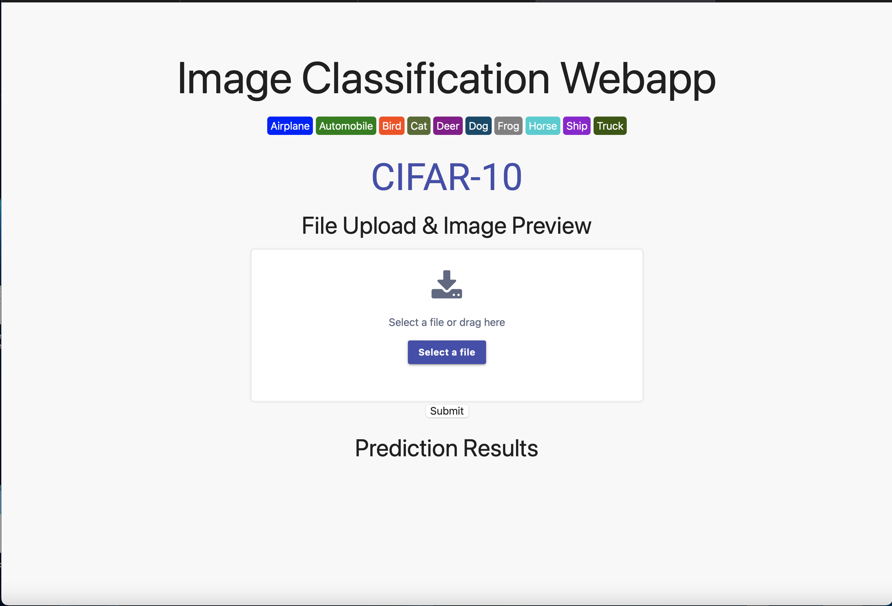

# Image Classification Webapp
The Image Classification Webapp is an AI-powered project that uses deep learning to classify an image. Developed using the CIFAR10 dataset and Flask, the project provides a user-friendly interface for users to upload an image and get the output as text, indicating the category of the image.

## Built With

* 
* 
* 
* 
* 
  

